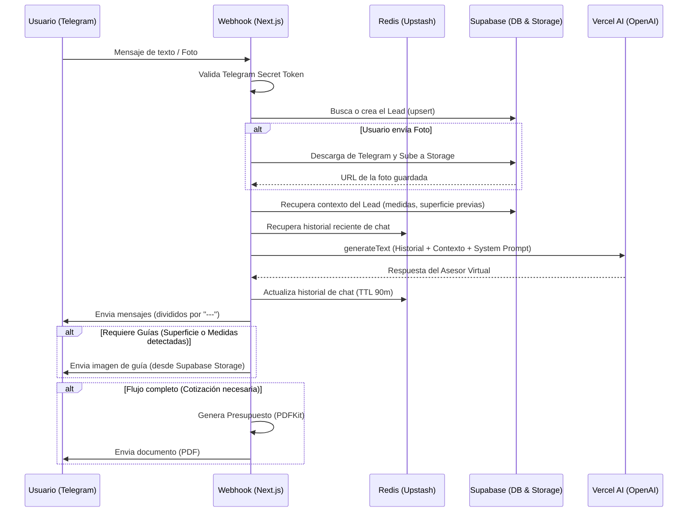

# Pixel Art Agent - Documentación Técnica

Esta documentación describe la arquitectura, las tecnologías utilizadas y el proceso de instalación del proyecto **Pixel Art Agent**, un bot automatizado para ventas por Telegram especializado en la cotización de ploteos y vinilos decorativos.

---

## 1. Stack Tecnológico

El proyecto está construido sobre un stack moderno, serverless y altamente escalable:

### Core Frameworks
* **[Next.js (App Router)](https://nextjs.org/)**: Framework principal.
  * *¿Por qué?* Permite exponer endpoints de API de forma sencilla (`/api/telegram/webhook`) integrándose perfectamente con un entorno Serverless como Vercel, eliminando la necesidad de mantener un servidor (como Express) encendido 24/7.
* **[TypeScript](https://www.typescriptlang.org/)**: Lenguaje principal.
  * *¿Por qué?* Aporta tipado estático, reduciendo errores en tiempo de ejecución (especialmente crítico al manejar payloads variables de APIs de terceros como Telegram o Supabase).

### Inteligencia Artificial
* **[Vercel AI SDK](https://sdk.vercel.ai/) & [OpenAI](https://openai.com/)**: Motor del agente.
  * *¿Por qué?* El SDK de Vercel simplifica la interacción con modelos LLM. Utilizamos llamadas con soporte para `tools` (function calling) que permite al modelo estructurar respuestas, extraer información (medidas, superficies) de forma determinista sin depender de que el LLM parsee texto crudo correctamente.

### Base de Datos y Almacenamiento
* **[Supabase (PostgreSQL)](https://supabase.com/)**: Base de datos relacional y almacenamiento en la nube.
  * *¿Por qué?* Es un backend-as-a-service robusto. Usamos la BD para guardar el estado del negocio (`leads`, `quotes`, `measurements`) para tener persistencia a largo plazo, métricas y reportes. Su módulo de *Storage* se utiliza para alojar y servir archivos dinámicos y fijos (imágenes de guías, fotos enviadas por el usuario, PDFs generados).

### Caché y Estado de Sesión
* **[Upstash Redis](https://upstash.com/)**: Base de datos clave-valor en memoria.
  * *¿Por qué?* En un entorno serverless, la memoria entre peticiones se pierde. Redis nos permite guardar el historial de la conversación (caché temporal de 90 minutos) de forma ultra rápida sin sobrecargar la base de datos relacional (Supabase) con cada mensaje de "hola" del usuario.

### Generación de Documentos
* **[PDFKit](https://pdfkit.org/)**: Librería generadora de PDF.
  * *¿Por qué?* Es la solución más estable para construir documentos en el lado del servidor sin necesitar un navegador headless (como Puppeteer, que pesa demasiado para Vercel). Permite dibujar con precisión el layout del presupuesto final que se enviará al cliente.

### Infraestructura
* **[Vercel](https://vercel.com/)**: Plataforma de despliegue.
  * *¿Por qué?* Ofrece despliegues automáticos desde Git, gestión de variables de entorno y ejecuta las rutas de Next.js como *Serverless Functions* globales, reduciendo los costos de infraestructura casi a cero si el tráfico es moderado.

---

## 2. Diagrama de Flujo (Webhook y Agente)

El siguiente diagrama describe el ciclo de vida de un mensaje entrante de Telegram hasta que el bot envía su respuesta.



---

## 3. Instalación y Configuración para Desarrollo Local

Para que otro desarrollador pueda tomar el proyecto y correrlo localmente, debe seguir estos pasos:

### Prerrequisitos
* **Node.js** (v18+ recomendado)
* Acceso al bot de Telegram (BotFather)
* Acceso a proyectos de Supabase y Upstash
* Clave de API de OpenAI

### Pasos

1. **Clonar el repositorio e instalar dependencias:**
   ```bash
   git clone <repo-url>
   cd PixelArtAgent
   npm install
   ```

2. **Configurar Variables de Entorno:**
   Crear un archivo `.env.local` en la raíz del proyecto. Deberá contener (como mínimo) las siguientes variables (solicitar los valores al administrador):

   ```env
   # Telegram
   TELEGRAM_BOT_TOKEN=tu_token_de_botfather
   TELEGRAM_WEBHOOK_SECRET=tu_secreto_para_proteger_el_webhook

   # Supabase
   NEXT_PUBLIC_SUPABASE_URL=https://tu-proyecto.supabase.co
   NEXT_PUBLIC_SUPABASE_ANON_KEY=tu_anon_key
   SUPABASE_SERVICE_ROLE_KEY=tu_service_role_key

   # OpenAI
   OPENAI_API_KEY=sk-tu_clave_de_openai

   # Upstash Redis
   UPSTASH_REDIS_REST_URL=https://tu-endpoint.upstash.io
   UPSTASH_REDIS_REST_TOKEN=tu_token_de_redis
   ```

3. **(Opcional) Inicializar assets estáticos en Supabase:**
   Si las imágenes guías no existen en el bucket `b2c-assets` de Supabase, puedes correr el script de seed:
   ```bash
   node src/agent/upload-guides.cjs
   ```
   *(Nota: Asegúrate de tener la variable de entorno expuesta al entorno de Node antes de correrlo).*

4. **Levantar el entorno de desarrollo:**
   ```bash
   npm run dev
   ```
   El servidor correrá en `http://localhost:3000`.

### Probando el Webhook Localmente

Telegram no puede enviar webhooks a `localhost`. Para probar localmente:

1. Instala y expón tu puerto con **Ngrok**:
   ```bash
   ngrok http 3000
   ```
2. Configura el webhook en Telegram para que apunte a tu URL temporal:
   ```bash
   curl -F "url=https://<TU-NGROK-ID>.ngrok-free.app/api/telegram/webhook" \
        -F "secret_token=<TU_WEBHOOK_SECRET>" \
        https://api.telegram.org/bot<TELEGRAM_BOT_TOKEN>/setWebhook
   ```

---

## 4. Estructura del Código

* `/src/app/api/telegram/webhook/route.ts`: Punto de entrada (webhook). Construye el contexto y llama al agente.
* `/src/agent/`: Lógica central del bot (AI SDK).
  * `index.ts`: Orquestador principal, inyección de guías y PDF.
  * `system-prompt.ts`: Las "reglas del cerebro" del asistente comercial, inyectando los datos de Supabase en el comportamiento del LLM.
* `/src/lib/`: Utilidades core (Base de datos, Caché, Storage, Precios, PDF).
* `/src/modules/channels/telegram.ts`: Cliente directo de la API de Telegram para envío de texto, fotos y documentos.
